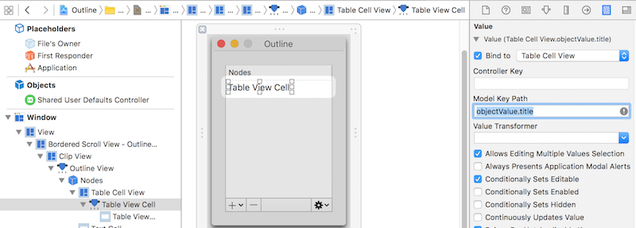
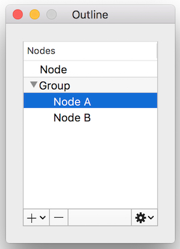
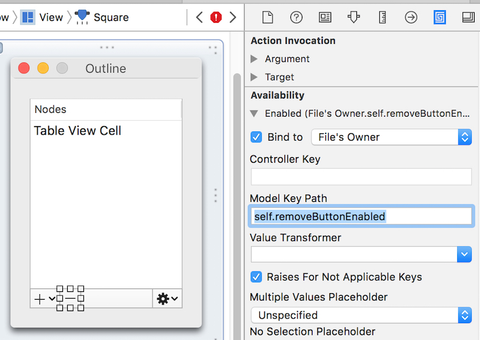
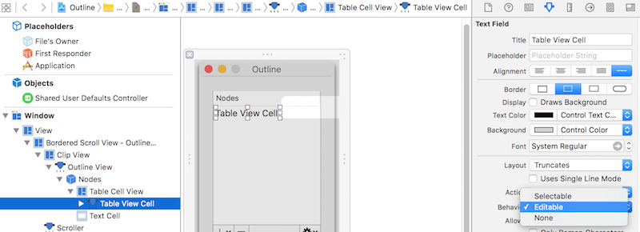

#Steps
##Create Basic Project
Refer to commit till [#fa626ee](https://github.com/atjason/CocoaDemoWithSwift/commit/fa626ee5f880da924a1c7fd7b8b988015020f2e6).
##Add Model Class of "Node"
Refer to commit till [#e302b91](https://github.com/atjason/CocoaDemoWithSwift/commit/e302b91f3d4268714323fd3d94c21a781ed135fb).
```swift
class Node: NSObject {
  var title = "Node"
  var isGroup = false
  var children = [Node]()
  weak var parent: Node?
  
  override init() {
    super.init()
  }
  
  init(title: String) {
    self.title = title
  }
  
  func isLeaf() -> Bool {
    return children.isEmpty
  }
}
```
##Add UI Controls
Refer to commit till [#5dee8d1](https://github.com/atjason/CocoaDemoWithSwift/commit/5dee8d160650624d55333808b7fa5e9fba6e0b9c).
After done, the UI looks like:
**UI**


##Implement NSOutlineViewDataSource
Refer to commit till [#c467d0b](https://github.com/atjason/CocoaDemoWithSwift/commit/c467d0b36a58994dca5f376d668777d8484a72fd).
Notes:
* Set NSOutlineView's dataSource to File's Owner.


* Bind value "Table Cell View" to "Table Cell View" > Model Key Path: objectValue.title.


After done, the UI looks like:

##Implement NSOutlineViewDelegate
Refer to commit till [#300948e](https://github.com/atjason/CocoaDemoWithSwift/commit/300948eaabd9afe72c1addcb0438102bc21c2783).
Notes:
* Set NSOutlineView's delegate to File's Owner.


##Add Node and Group
Refer to commit till [#f18c61f](https://github.com/atjason/CocoaDemoWithSwift/commit/f18c61f94bd813f0ae2c0d2d33dbc6054f530d61).
Notes:
* The logic to add node or group in correct position is very boring. That's why binding will be  a good friend.
* There're 2 ways to insert item in outline view. One is update the data modal, then call `NSOutlineView.reloadData()`. But this will let UI flash. So it's better to manually insert item in outline view (e.g., use `NSOutlineView.insertItemsAtIndexes`). Another benefit is could use animation during inserting.

After done, you can add node or group. The UI looks like:


##Implement other UI Operations
The operations include remove, edit, move up and move down. It's not hard. But the logic is complex and boring. Be careful.
Refer to commit till [#3f7ffaa](https://github.com/atjason/CocoaDemoWithSwift/commit/3f7ffaa8efb62b5e08d2f53da693da05055a80cf).
Notes
* Could create a **dynamic** property (e.g., `dynamic var removeButtonEnabled = false`), and then bind a control's enable property to it. e.g.,


* Should set table view cell's behavior as "Editable" to edit it.



